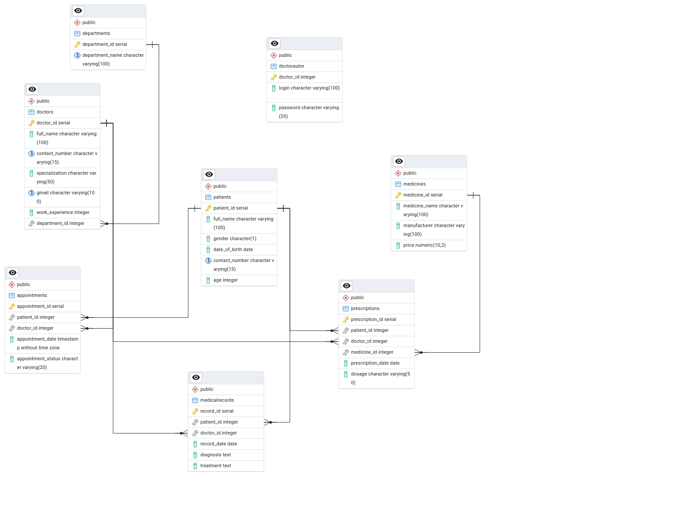

# В рамках данной работы была разработана даталогическая модель базы данных "Больница"
## Для восстановления копии БД необходимо использовать команды : 
````
sudo -i -u postgres
psql Hospital < hospital.sql
````
## Приведём подробное описание структуры базы данных. Информация о таблицах:
## Таблица patients
  Поле | Тип данных | Описание |
 |:--------------:|:--------------------:|:---------------:|
 |  patient_id  | INT    | Уникальный идентификатор пациента   |
 |  full_name   | VARCHAR(100)    | Полное имя пациента   |
 |  gender      | CHAR(1)    | Пол пациента (М - мужской, Ж - женский) |
 |  date_of_birth   | DATE    | Дата рождения   |
 |  contact_number   | VARCHAR(15)    | Номер телефона пациента  |
 |  age   | INT    | Сколько лет пациенту   |

## Таблица doctors
  Поле | Тип данных | Описание |
 |:--------------:|:--------------------:|:---------------:|
 |  doctor_id  | INT    | Уникальный идентификатор врача   |
 |  full_name   | VARCHAR(100)    | Полное имя врача   |
 |  contact_number      | VARCHAR(15)    | Номер телефона врача |
 |  specialization   | VARCHAR(50)    | Специализация врача  |
 |  gmail   | VARCHAR(100)    | Почта врача |
 |  work_experience   | INT    | Стаж работы врача (в годах)   |
 |  department_id  |  INT | Идентификатор отдела, в котором работает врач |

## Таблица departments
  Поле | Тип данных | Описание |
 |:--------------:|:--------------------:|:---------------:|
 |  department_id  | INT    | Уникальный идентификатор отдела   |
 |  department_name   | VARCHAR(100)    | Название отдела  |

## Таблица appointments
  Поле | Тип данных | Описание |
|:--------------:|:--------------------:|:---------------:|
 |  appointment_id  | INT    | Уникальный идентификатор записи   |
 |  doctor_id   |INT   | Идентификатор врача   |
 |  patient_id      | INT   | Идентификатор пациентаа |
 |  appointment_date   | TIMESTAMP    | Дата записи  |
 |  appointment_status   | VARCHAR(20)    | Статус записи (только  "Запланировано", "Отменено" или "Завершено") |

## Таблица medicalrecords
  Поле | Тип данных | Описание |
 |:--------------:|:--------------------:|:---------------:|
 |  record_id  |  INT   | Уникальный идентификатор медицинской записи   |
 |  patient_id   | INT  | Идентификатор пациента  |
 |  doctor_id      | INT   | Идентификатор врача |
 |  record_date   | DATE    | Дата записи  |
 |  diagnosis   | TEXT    | Диагноз |
 |  treatment   | TEXT    | Лечение   |

## Таблица medicines
  Поле | Тип данных | Описание |
 |:--------------:|:--------------------:|:---------------:|
 |  medicine_id  | INT    | Уникальный идентификатор лекарства   |
 |  medicine_name   | VARCHAR(100)  | Название лекарства |
 |  manufacturer      | VARCHAR(100)   | У кого закупается лекарство |
 |  price   | DECIMAL(10,2)    | Цена лекарства  |

## Таблица prescriptions
  Поле | Тип данных | Описание |
 |:--------------:|:--------------------:|:---------------:|
 |  prescription_id  |  INT   | Уникальный идентификатор рецепта  |
 |  doctor_id      | INT   | Идентификатор врача |
 |  patient_id   | INT  | Идентификатор пациента  |
 |  medicine_id   | INT    | Идентификатор лекарства  |
 |  prescription_date   | DATE    | Дата выписки рецепта |
 |  dosage   | VARCHAR(50)    | Дозировка   |
		
## Таблица doctorautor
  Поле | Тип данных | Описание |
 |:--------------:|:--------------------:|:---------------:|
 |  doctor_id      | INT   | Идентификатор врача |
 |  login   | VARCHAR(100)  | Логин врача |
 |  password      | VARCHAR(20)   | Пароль врача |

## Общая схема БД:


Использование интуитивно понятное, БД больница, может применятся:

Администраторами клиники: 

1.Управление информацией о пациентах, врачах и медицинских записях.

2.Генерация отчетов о работе клиники.

Врачами:

1.Просмотр и обновление медицинских записей пациентов.

2.Выписка рецептов.

3.Просмотр записей.

Пациентами:

1.Просмотр информации о своих записях к врачам и рецептах.

2.Запись на прием к врачу.

P.S.*На многих атрибутах есть ограничения NOT NULL, каждая из таблиц содержит PRIMARY KEY, в БД используются внешние ключи для организации отношений между таблицами, а так же примеры запросов можно найти подробнее в ПРИЛОЖЕНИИ.*

## Для взаимодействия с данной БД используйте скрит hospital_programm.py:
````
python3 hospital_programm.py
````
## Данная программа представляет собой личный кабинет для врача, логин и пароль генерируются автоматически в самой БД. Для проверки, необзодимо взять их из таблицы doctorautor. В перечне возможных действий : Просмотреть записи на сегодняшний день, Добавить медицинскую запись, Добавить рецепт, Добавить запись пациента, Выйти.
## Некоторые действия могут вызвать ошибку, такие как: неверный логин/пароль, запись мужчины к врачу-гинекологу, запись на время, где уже стоит другая запись. Список всех триггеров, функций, запросов, а так же их исходного кода можно найти в отчёте, который располагается в папке report.

